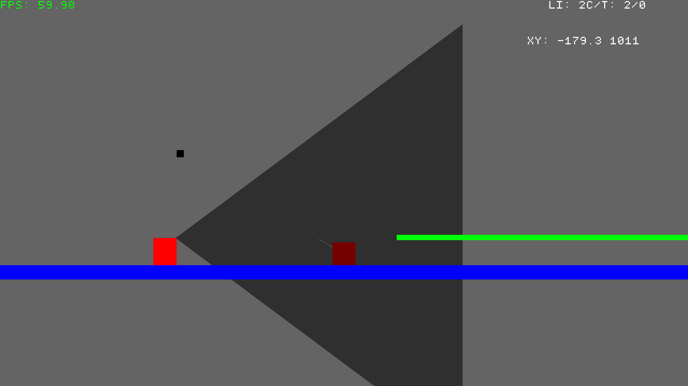

# My SDL Game engine
Game engine, written in C++ with SDL. Full support for [config files!](./doc/config.md)



## Building

### Dependencies

- Linux
- SDL2
- g++
- CMake
- Make

### Build

```sh
$ git clone https://github.com/RyanQueirozS/SDL_cpp.git
$ cd SDL_cpp
$ cmake .
$ make
 
# You need to have a config file, to do so:
$ mkdir $HOME/.config/SDLcpp 
$ cp ./doc/exampleconfig.toml $HOME/.config/SDLcpp/config.toml

# To run the game
$ ./bin/SDL_cpp
```
